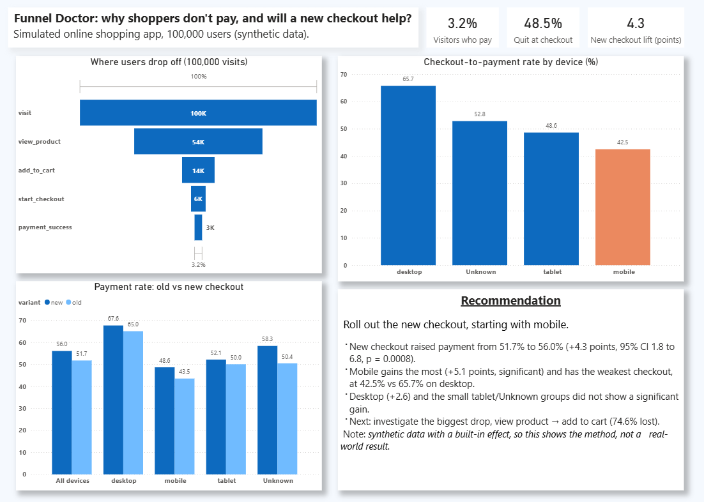

# Funnel Doctor

Find where shoppers drop off before paying, work out why, and test whether a redesigned checkout helps.

## The problem
A online shopping app wants to know why people visit but don't buy.
Funnel: Visit → View product → Add to cart → Start checkout → Pay

## Data
Synthetic event data for 100,000 users, generated in Python. I chose synthetic data so I could control the messiness (duplicate events, bot-like users, missing values) and the A/B test effect. The reasoning is in `decisions.md`.

## What I did
1. **Cleaned the data (SQL):** removed 7,720 duplicate events and 2,000 bots (more than 10 events per user). Labelled missing device/city (about 4% each) as "Unknown".
2. **Built the funnel:** 100,000 visits → 3,181 payments (3.2%).
3. **Broke it down by segment:** device, page speed, source, city, plus a cohort check.
4. **Ran an A/B test (SciPy):** old vs new checkout, users split randomly 50/50 with a fixed seed.
5. **Built a Power BI dashboard** with the funnel, segments, test result and recommendation.

## Key findings
- Biggest drop-off: view product → add to cart (74.6% lost).
- 48.5% of users who start checkout don't pay.
- Mobile checkout-to-pay is 42.5% vs 65.7% on desktop.
- Slow pages convert at 1.8% vs 3.8% on fast pages.
- Source and city made no meaningful difference (about 3.1–3.5%).
- **A/B test:** new checkout 56.0% vs old 51.7% (+4.3 points, 95% CI 1.8 to 6.8, p = 0.0008). Mobile gained +5.1 points (p = 0.003).

## Recommendation
Roll out the new checkout, starting with mobile. Then investigate the biggest drop, view product → add to cart.

## Limitations
- Data is synthetic and the test effect was built in, so this shows my method, not a real-world result.
- Desktop (+2.6, p = 0.19), tablet and Unknown groups were too small to show a significant gain.
- Novelty effects could not be measured.

## Tools
Python (Pandas, NumPy, SciPy), PostgreSQL, Power BI, Jupyter, GitHub.

## Repo guide
`data/` · `sql/` · `notebooks/` · `docs/` · `dashboard/`